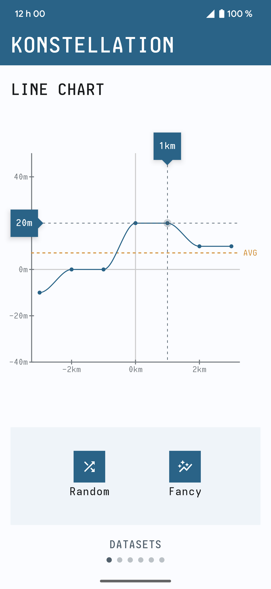

# UNMAINTAINED
⚠️ Due to a lack of time I'm unable to work on this library anymore. I've created this project to provide charts to Jetpack Compose, there is good alt libraries you can now find around GitHub ;)

---

Konstellation is a Jetpack Compose library that provides a set of components and tools to build
beautiful and consistent graphs.

  <picture>
    <source media="(prefers-color-scheme: dark)" srcset="pictures/screen_dark.png">
    <source media="(prefers-color-scheme: light)" srcset="pictures/screen_light.png">
    
  </picture>

